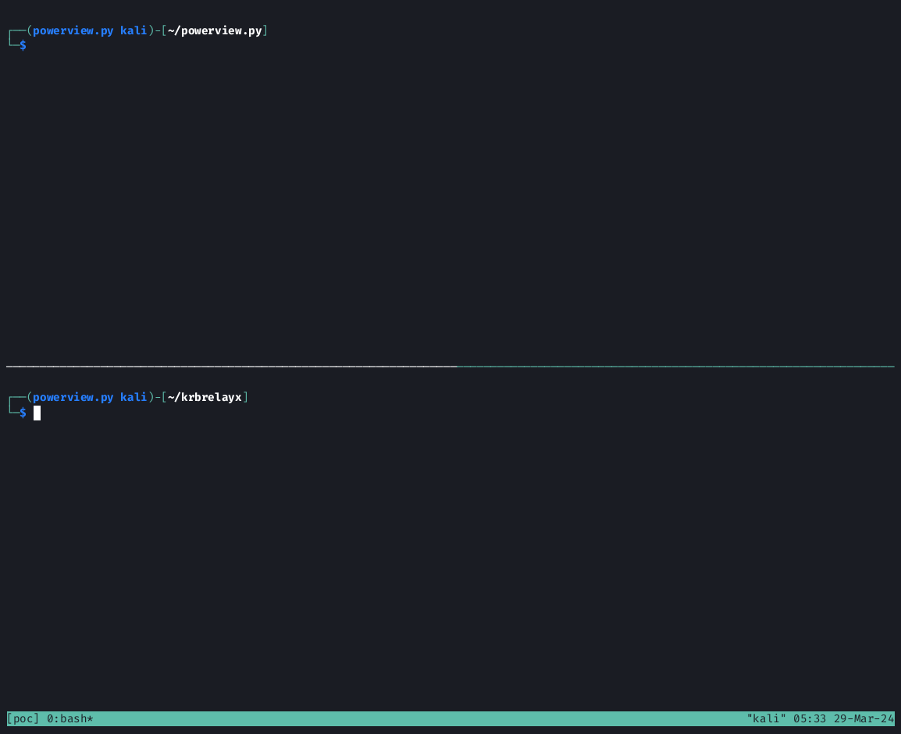

# PowerView.py

[Installation](#installation) | [Basic Usage](#basic-usage) | [Modules](#module-available-so-far) | [Logging](#logging)

PowerView.py is an alternative for the awesome original [PowerView.ps1](https://github.com/PowerShellMafia/PowerSploit/blob/master/Recon/PowerView.ps1) script. Most of the modules used in PowerView are available here ( some of the flags are changed ). Main goal is to achieve interactive session without having to repeatedly authenticate to ldap.

## Installation
Since powerview.py now supports Channel Binding and Seal and Sign, [gssapi](https://github.com/sigmaris/python-gssapi) is part of the dependencies which requires `libkrb5-dev` package from apt.
* Pypi
```bash
sudo apt install libkrb5-dev
pip3 install powerview
```

* Pipx
```bash
sudo apt install libkrb5-dev
pipx install "git+https://github.com/aniqfakhrul/powerview.py"
```

* curl
```
curl -L powerview.sh | sh
```

* Manual
```
git clone https://github.com/aniqfakhrul/powerview.py
cd powerview.py
sudo apt install libkrb5-dev
./intall.sh
```
> [!NOTE]
> In case the installation throws error regarding `gssapi` library. You might need to install `libkrb5-dev` (Debian/Ubuntu) or `krb5-devel` (CentOS)
> `sudo apt install libkrb5-dev`

## Basic Usage
> [!NOTE]
> Note that some of the kerberos functions are still not functioning well just yet but it'll still do most of the works. Detailed usage can be found in [Wiki](https://github.com/aniqfakhrul/powerview.py/wiki) section

* Init connection
```
powerview range.net/lowpriv:Password123@192.168.86.192 [--dc-ip 192.168.86.192] [-k] [--use-ldap | --use-ldaps]
```
* Init connection with specific authentication. Note that `--use-sign-and-seal` and `--use-channel-binding` is only available if you install `ldap3` library directly from this [branch](https://github.com/ThePirateWhoSmellsOfSunflowers/ldap3/tree/tls_cb_and_seal_for_ntlm) 
```
powerview range.net/lowpriv:Password123@192.168.86.192 [--use-channel-binding | --use-sign-and-seal | --use-simple-auth]
```
* Init with schannel. `--pfx` flag accept pfx formatted certificate file.
> [!NOTE]  
> powerview will try to load certificate without password on the first attempt. If it fails, it'll prompt for password. So, no password parameter needed
```
powerview 10.10.10.10 --pfx administrator.pfx
```


* Query for specific user
```
Get-DomainUser Administrator
Get-DomainUser -Identity Administrator
```

* Specify search attributes
```
Get-DomainUser -Properties samaccountname,description
```

* Filter results
```
Get-DomainUser -Where 'samaccountname [contains][in][eq] admins'
```

* Count results
```
Get-DomainUser -Count
```

* Output result to file
```
Get-DomainUser -OutFile ~/domain_user.txt
```

* Format output in a table
```
Get-DomainUser -Properties samaccountname,memberof -TableView
```

* Set module
```
Set-DomainObject -Identity "adminuser" -Set 'servicePrincipalname=http/web.ws.local'
Set-DomainObject -Identity "adminuser" -Append 'servicePrincipalname=http/web.ws.local'
Set-DomainObject -Identity "adminuser" -Clear 'servicePrincipalname'

# Reading from local file
Set-DomainObject -Identity "adminuser" -Set 'servicePrincipalname=@/path/to/local/file'
Set-DomainObject -Identity "adminuser" -Append 'servicePrincipalname=@/path/to/local/file'
```

* Relay mode
```
powerview 10.10.10.10 --relay [--relay-host] [--relay-port] [--use-ldap | --use-ldaps]
```



> [!NOTE]  
> This demonstration shows coerced authentication was made using `printerbug.py`. You may use other methods that coerce HTTP authentication.

## Module available (so far?)

```cs
PV >
Add-ADComputer                 Get-Domain                     Get-NetComputer                Remove-DomainOU 
Add-ADUser                     Get-DomainCA                   Get-NetDomain                  Remove-DomainObject 
Add-CATemplate                 Get-DomainCATemplate           Get-NetDomainController        Remove-DomainObjectAcl 
Add-CATemplateAcl              Get-DomainComputer             Get-NetGPO                     Remove-DomainUser 
Add-DomainCATemplate           Get-DomainController           Get-NetGroup                   Remove-GPLink 
Add-DomainCATemplateAcl        Get-DomainDNSRecord            Get-NetGroupmember             Remove-GroupMember 
Add-DomainComputer             Get-DomainDNSZone              Get-NetLoggedOn                Remove-OU 
Add-DomainDNSRecord            Get-DomainForeignGroupMember   Get-NetOU                      Remove-ObjectAcl 
Add-DomainGPO                  Get-DomainForeignUser          Get-NetService                 Set-ADObject 
Add-DomainGroupMember          Get-DomainGMSA                 Get-NetSession                 Set-ADObjectDN 
Add-DomainOU                   Get-DomainGPO                  Get-NetShare                   Set-CATemplate 
Add-DomainObjectAcl            Get-DomainGPOLocalGroup        Get-NetTrust                   Set-DomainCATemplate 
Add-DomainUser                 Get-DomainGroup                Get-NetUser                    Set-DomainComputerPassword 
Add-GPLink                     Get-DomainGroupMember          Get-ObjectAcl                  Set-DomainDNSRecord 
Add-GPO                        Get-DomainOU                   Get-ObjectOwner                Set-DomainObject 
Add-GroupMember                Get-DomainObject               Get-RBCD                       Set-DomainObjectDN 
Add-OU                         Get-DomainObjectAcl            Get-RegLoggedOn                Set-DomainObjectOwner 
Add-ObjectAcl                  Get-DomainObjectOwner          Get-SCCM                       Set-DomainRBCD 
ConvertFrom-SID                Get-DomainRBCD                 Invoke-Kerberoast              Set-DomainUserPassword 
ConvertFrom-UACValue           Get-DomainSCCM                 Remove-ADComputer              Set-ObjectOwner 
Disable-DomainDNSRecord        Get-DomainTrust                Remove-ADObject                Set-RBCD 
Find-ForeignGroup              Get-DomainUser                 Remove-ADUser                  Unlock-ADAccount 
Find-ForeignUser               Get-Exchange                   Remove-CATemplate              clear 
Find-LocalAdminAccess          Get-ExchangeServer             Remove-DomainCATemplate        exit 
Get-ADObject                   Get-GMSA                       Remove-DomainComputer          
Get-CA                         Get-GPOLocalGroup              Remove-DomainDNSRecord         
Get-CATemplate                 Get-NamedPipes                 Remove-DomainGroupMember       
```

### Domain/LDAP Functions

| Module | Alias | Description |
| ------ | ----- | ---- |
|Get-DomainUser|Get-NetUser|Query for all users or specific user objects in AD|
|Get-DomainComputer|Get-NetComputer|Query for all computers or specific computer objects in AD|
|Get-DomainGroup|Get-NetGroup|Query for all groups or specific group objects in AD|
|Get-DomainGroupMember|Get-NetGroupMember|Query the members for specific domain group |
|Get-DomainOU|Get-NetOU|Query for all OUs or specific OU objects in AD|
|Get-Domain|Get-NetDomain|Query for domain information|
|Get-DomainController|Get-NetDomainController|Query for available domain controllers|
|Get-DomainDNSRecord||Query for available records. It will recurse all DNS zones if doesn't specify -ZoneName|
|Get-DomainDNSZone||Query for available DNS zones in the domain|
|Get-DomainObject|Get-ADObject|Query for all or specified domain objects in AD|
|Get-DomainObjectAcl|Get-ObjectAcl|Query ACLs for specified AD object|
|Get-DomainSCCM|Get-SCCM|Query for SCCM|
|Get-DomainRBCD|Get-RBCD|Finds accounts that are configured for resource-based constrained delegation|
|Get-DomainObjectOwner|Get-ObjectOwner|Query owner of the AD object|
|Get-DomainGMSA|Get-GMSA|Query objects with GMSA attributes and decode the password blob|
|Remove-DomainDNSRecord||Remove Domain DNS Record|
|Remove-DomainComputer|Remove-ADComputer|Remove Domain Computer|
|Remove-DomainGroupMember|Remove-GroupMember|Remove member of a specific Domain Group|
|Remove-DomainOU|Remove-OU|Remove OUs or specific OU objects in AD|
|Remove-DomainObjectAcl|Remove-ObjectAcl|Remove ACLs for specified AD object|
|Remove-DomainObject|Remove-ADObject|Remove specified Domain Object|
|Remove-DomainUser|Remove-ADUser|Remove specified Domain User in AD|
|Set-DomainDNSRecord||Set Domain DNS Record|
|Set-DomainUserPassword||Set password for specified Domain User|
|Set-DomainComputerPassword||Set password for specified Domain Computer|
|Set-DomainObject|Set-ADObject|Set for specified domain objects in AD|
|Set-DomainObjectDN|Set-ADObjectDN| Modify object's distinguishedName attribute as well as changing OU|
|Set-DomainObjectOwner|Set-ObjectOwner|Set owner of the AD object|
|Add-DomainDNSRecord||Add Domain DNS Record|
|Disable-DomainDNSRecord||Disabling DNS Record by pointing to invalid address|
|Add-DomainUser|Add-ADUser|Add new Domain User in AD|
|Add-DomainComputer|Add-ADComputer|Add new Domain Computer in AD|
|Add-DomainGroupMember|Add-GroupMember|Add new member in specified Domain Group in AD|
|Add-DomainOU|Add-OU|Add new OU object in AD|
|Add-DomainGPO|Add-GPO|Add new GPO object in AD|
|Add-DomainObjectAcl|Add-ObjectAcl|Supported rights so far are All, DCsync, RBCD, ShadowCred, WriteMembers|

### GPO Functions

| Module | Alias | Description |
| ------ | ----- | ---- |
|Get-DomainGPO|Get-NetGPO| Query for domain group policy objects |
|Get-DomainGPOLocalGroup|Get-GPOLocalGroup|Query all GPOs in a domain that modify local group memberships through `Restricted Groups` or `Group Policy preferences`|
|Add-GPLink||Create new GPO link to an OU|
|Remove-GPLink||Remove GPO link from an OU|

### Computer Enumeration Functions

| Module | Alias | Description |
| ------ | ----- | ---- |
|Get-NetSession||Query session information for the local or a remote computer|
|Get-NetShare||Query open shares on the local or a remote computer|
|Get-NetLoggedOn||Query logged on users on the local or a remote computer|

### ADCS Functions

| Module | Alias | Description |
| ------ | ----- | ---- |
|Get-DomainCATemplate|Get-CATemplate|Query for available CA templates. Supports filtering for vulnerable template|
|Get-DomainCA|Get-CA|Query for Certificate Authority(CA)|
|Remove-DomainCATemplate|Remove-CATemplate|Remove specified Domain CA Template|
|Set-DomainCATemplate|Set-CATemplate|Modify domain object's attributes of a CA Template|
|Add-DomainCATemplate|Add-CATemplate|Add new Domain CA Template|
|Add-DomainCATemplateAcl|Add-CATemplateAcl|Add ACL to a certificate template. Supported rights so far are All, Enroll, Write|

### Exchange Functions

| Module | Alias | Description |
| ------ | ----- | ----------- |
|Get-ExchangeServer|Get-Exchange|Retrieve list of available exchange servers in the domain|

### Domain Trust Functions

| Module | Alias | Description |
| ------ | ----- | ---- |
|Get-DomainTrust|Get-NetTrust|Query all Domain Trusts|
|Get-DomainForeignUser|Find-ForeignUser|Query users who are in group outside of the user's domain|
|Get-DomainForeignGroupMember|Find-ForeignGroup|Query groups with users outside of group's domain and look for foreign member|

### Misc Functions

| Module | Alias | Description |
| ------ | ----- | ---- |
|ConvertFrom-SID||Convert a given security identifier (SID) to user/group name|
|ConvertFrom-UACValue||Converts a UAC int value to human readable form|
|Get-NamedPipes||List out Named Pipes for a specific computer|
|Invoke-Kerberoast||Requests kerberos ticket for a specified service principal name (SPN)|
|Unlock-ADAccount||Unlock domain accounts by modifying lockoutTime attribute|
|Find-LocalAdminAccess||Finds computer on the local domain where the current has a Local Administrator access|

### Logging

We will never miss logging to keep track of the actions done. By default, powerview creates a `.powerview` folder in current user home directory _(~)_. Each log file is generated based on current date.
Example path: `/root/.powerview/logs/bionic.local/2024-02-13.log`

### To-Do
* ~~Add logging function to track and monitor what have been run.~~
* ~~Add cache functionality to minimize network interaction.~~
* Support more authentication flexibility.
    * ~~Channel Binding~~
    * ~~Sign and Seal~~
    * ~~Simple Authentication~~
    * ~~Schannel. Authentication with pfx~~
* ~~Add `ProtectedFromAccidentalDeletion` attribute to `Get-DomainOU`~~

### Credits
* https://github.com/SecureAuthCorp/impacket
* https://github.com/CravateRouge/bloodyAD
* https://github.com/PowerShellMafia/PowerSploit/blob/master/Recon/PowerView.ps1
* https://github.com/ThePorgs/impacket/
* https://github.com/the-useless-one/pywerview
* https://github.com/dirkjanm/ldapdomaindump
* https://learn.microsoft.com/en-us/powershell/module/grouppolicy/new-gplink
* https://github.com/ThePirateWhoSmellsOfSunflowers/ldap3/tree/tls_cb_and_seal_for_ntlm
* https://github.com/ly4k/Certipy
